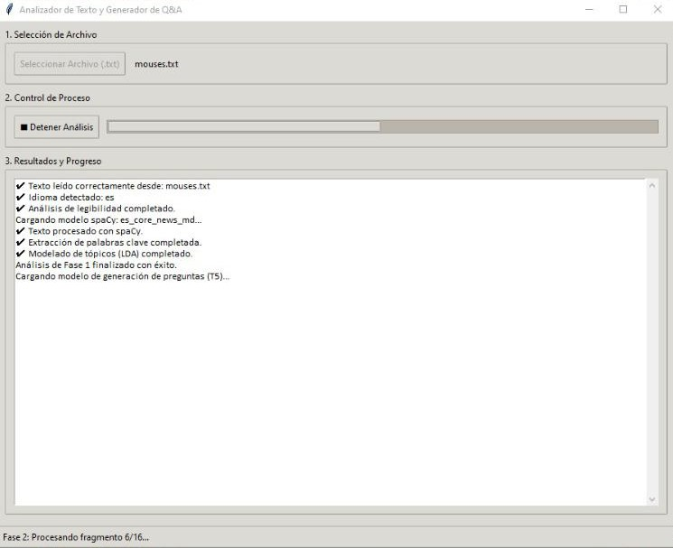
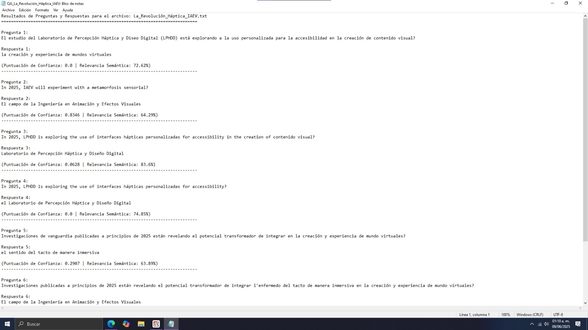

<p align="center">
  
</p>

<h1 align="center">
📖 Analíticas de Lectura Inteligente
</h1>

<p align="center">
Potenciando el Aprendizaje con Inteligencia Artificial
</p>

## 🎯 Descripción

Este proyecto fue desarrollado como trabajo de tesis para la obtención del grado de Ingeniería en Tecnologías de la Información.

Su propósito es aplicar técnicas de Inteligencia Artificial y Procesamiento de Lenguaje Natural (NLP) para fortalecer la comprensión lectora mediante el análisis automatizado de documentos, la generación de preguntas y la evaluación semántica de las respuestas del usuario.

La herramienta está dirigida principalmente a estudiantes como apoyo autodidacta, aunque también puede ser utilizada por docentes para identificar oportunidades de mejora en el aprendizaje de sus alumnos.

## 💡 Problema que resuelve

Actualmente, muchos estudiantes presentan dificultades para comprender, analizar e interpretar la información que leen, lo que afecta su capacidad para construir conocimiento y generar ideas propias.

Este proyecto busca apoyar dicho proceso mediante una herramienta inteligente capaz de:


- Analizar documentos PDF.
- Detectar automáticamente el idioma.
- Traducir el contenido cuando es necesario.
- Generar resúmenes.
- Crear preguntas automáticamente.
- Evaluar respuestas utilizando modelos de IA.
- Medir la coherencia semántica entre pregunta y respuesta.
- Generar reportes con métricas de desempeño.

## ✨ Objetivos

### Objetivo General

Desarrollar una herramienta basada en Inteligencia Artificial y Procesamiento de Lenguaje Natural capaz de fortalecer la comprensión lectora mediante el análisis automático de documentos, la generación de preguntas y la evaluación semántica de respuestas.

### Objetivos específicos

- Detectar automáticamente el idioma del documento.
- Analizar el contenido mediante técnicas de NLP.
- Extraer los temas principales del texto.
- Generar preguntas de manera automática.
- Evaluar la coherencia semántica de las respuestas.
- Generar métricas que apoyen el aprendizaje del estudiante.

## 🚀 Funcionamiento general
1. El usuario carga un documento.
2. El sistema analiza el contenido.
3. Se identifican los temas principales.
4. Se generan preguntas automáticamente.
5. El usuario responde.
6. La IA analiza las respuestas.
7. Se genera un reporte con métricas.
   
## 🧠 Arquitectura de IA

| Modelo | Función |
|---------|----------|
| spaCy | Procesamiento del lenguaje |
| NLTK | Tokenización |
| YAKE | Extracción de palabras clave |
| LDA | Detección de temas |
| T5 | Generación automática de preguntas |
| RoBERTa QA | Extracción de respuestas |
| Sentence Transformers | Evaluación semántica |
| fast-langdetect | Detección del idioma |

## 📊 Arquitectura del Sistema

El  siguiente diagrama muestra el flujo completo del sistema desarrollado, desde la carga del documento hasta la generación del reporte final. Cada etapa representa un módulo del pipeline de Procesamiento de Lenguaje Natural (NLP) y los modelos de Inteligencia Artificial utilizados durante el análisis.

<p align="center">
  
</p>

El sistema inicia con la carga del documento, realiza el preprocesamiento y la detección automática del idioma. Posteriormente ejecuta un pipeline de NLP que incluye tokenización, procesamiento lingüístico, extracción de palabras clave, modelado de temas y generación de resúmenes. Finalmente genera preguntas, analiza las respuestas del usuario mediante RoBERTa QA, calcula la similitud semántica utilizando Sentence Transformers y produce un reporte con métricas y analíticas del aprendizaje.
---

## 📂 Estructura del proyecto

```text
analiticas_lectura_inteligente_ia
│
├── README.md
├── LICENSE
├── requirements.txt
│
├── assets/
│   ├── Banner.png
│   ├── Diagrama.png
│   ├── interfazGrafica.jpeg
│   └── Reporte.jpeg
│
├── src/
│   ├── main.py
│   ├── preprocessing.py
│   ├── language_detector.py
│   ├── topic_model.py
│   ├── question_generator.py
│   ├── answer_extractor.py
│   ├── semantic_similarity.py
│   └── report_generator.py
│
└── examples/
```

## 🛠 Tecnologías

- Python
- VS Code
- Anaconda
- Spyder
- Google Colab
- Hugging Face
- PyTorch
## ⚙️ Instalación

Clonar el repositorio

```bash
git clone https://github.com/citlallimt/analiticas_lectura_inteligente_ia.git
```

Entrar al proyecto

```bash
cd analiticas_lectura_inteligente_ia
```

Instalar dependencias

```bash
pip install -r requirements.txt
```

Ejecutar

```bash
python src/main.py
```
## 📊 Resultados Generados y Casos de Uso

A continuación se detalla el comportamiento del prototipo funcional durante la carga, análisis y procesamiento semántico de un manuscrito técnico:

### 🔍 Módulo 1: Análisis Descriptivo y Sintáctico del Documento
En la primera interfaz del sistema, tras la carga del manuscrito, el pipeline de NLP extrae y segmenta de forma automatizada las métricas iniciales del texto.



*   **Síntesis Estructurada:** Generación automática del resumen ejecutivo del documento para una comprensión rápida.
*   **Variables Volumétricas:** Conteo preciso de palabras totales, estructuras oracionales y caracteres procesados para determinar la densidad del archivo.
*   **Descriptores Temáticos:** Extracción de palabras clave del entorno y modelado de tópicos probabilísticos mediante la técnica **LDA Extraction**, agrupando conceptos de manera semántica.

---

### 🧠 Módulo 2: Evaluación Interactiva y Extracción Contextual (QA)
La segunda pestaña despliega la capa interactiva orientada a la evaluación adaptativa, utilizando modelos avanzados de QA (Question Answering).


*   **Generación de Cuestionarios:** Formulación dinámica de preguntas basadas estrictamente en la información del documento (ej. *"¿Cuáles son los principales beneficios de incorporar la IA...?"*).
*   **Tablero Analítico Interno:** Visualización en tiempo real del reporte de consulta de extractos automáticos generados por la IA, validando el origen y la veracidad de la información en el cuerpo del manuscrito para mitigar alucinaciones de los modelos de lenguaje.

---

### 💾 Módulo 3: Serialización de Datos y Reporte Semántico (TXT/PDF)
El pipeline culmina exportando los resultados analíticos a un formato limpio y estructurado de consumo rápido.



*   **Análisis Multilingüe y Similitud:** Registro detallado que confronta las preguntas generadas con las respuestas dadas por el usuario.
*   **Métricas de Confianza:** Cálculo del porcentaje de **Relevancia Semántica** utilizando Sentence Transformers, permitiendo evaluar cuantitativamente el nivel de comprensión lectora o precisión conceptual alcanzada por el evaluado.

  ## 🖥️ Flujo de Interacción e Interfaz del Sistema

El prototipo funcional cuenta con un flujo estructurado de interacción interactiva que combina el análisis sintáctico con la evaluación semántica adaptativa:

---

### 1️⃣ Inicio e Interfaz Principal
Al ejecutar la aplicación, el usuario accede al panel principal de **Analíticas de Lectura Inteligente**. En esta etapa inicial se define la cantidad de preguntas a evaluar y el sistema queda a la espera de la carga del documento fuente.

<p align="center">
  
</p>

---

### 2️⃣ Selección de Documento y Destino del Reporte
El usuario selecciona el manuscrito en formato de texto (`.txt`) y especifica la carpeta de destino donde se guardará automáticamente el reporte analítico resultante.

<p align="center">
  
  
</p>

---

### 3️⃣ Selección de Modalidad de Evaluación
Finalizado el procesamiento inicial de NLP, la aplicación consulta al usuario la modalidad de evaluación: **Cuestionario Manual** (evaluación al estudiante) o **Extracción Automática por IA**.

<p align="center">
  
</p>

---

### 4️⃣ Análisis Sintáctico y Descriptores Temáticos
Una vez procesado el texto, la pestaña **Resumen y Semántica** despliega las métricas cuantitativas y cualitativas del documento:

<p align="center">
  
</p>

* **Síntesis Estructurada:** Generación automática del resumen ejecutivo del manuscrito.
* **Variables Volumétricas:** Conteo de palabras totales, oraciones procesadas y caracteres.
* **Descriptores Temáticos Clave:** Extracción de palabras clave y agrupación de tópicos probabilísticos mediante **LDA Extraction**.

---

### 5️⃣ Evaluación Interactiva y Validación Semántica
Si se seleccionó la modalidad manual, la pestaña **Evaluación Interactiva** presenta los reactivos generados por la IA. El usuario ingresa sus respuestas y, al presionar **Validar Cuestionario**, el modelo **Sentence Transformers** evalúa la coherencia semántica en tiempo real.

<p align="center">
  
</p>

* **Módulo de Comprensión:** Presentación dinámica de preguntas y captura de respuestas del estudiante.
* **Tablero Analítico:** Coincidencia semántica (%), comparación directa con las referencias de la IA y retroalimentación pedagógica personalizada.


## 📈 Estado del proyecto

✅ Proyecto de tesis finalizado.

Actualmente se encuentra en proceso de documentación y organización para su publicación como portafolio profesional en GitHub.

En futuras versiones se contempla incorporar nuevas funcionalidades enfocadas en analítica educativa, evaluación del aprendizaje y mejora de la interacción mediante Inteligencia Artificial.

📌 Nota: Este proyecto fue desarrollado con fines académicos para la obtención del título de Ingeniería en Tecnologías de la Información en la Universidad Politecnica Metropolitana de Hidalgo . El código se comparte exclusivamente de forma pública con fines de demostración de competencias profesionales y portafolio laboral.
