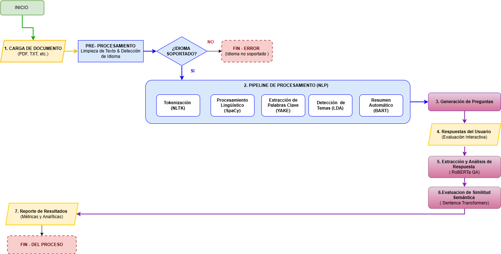
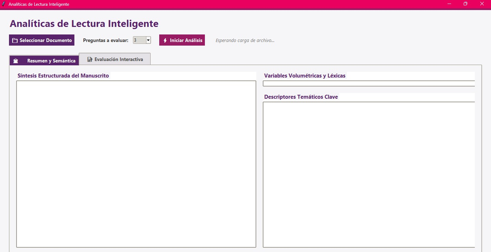
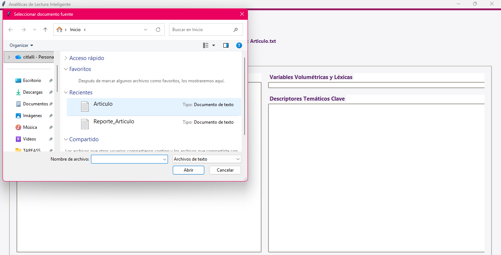
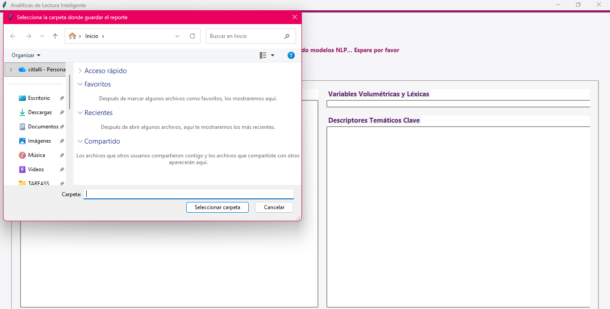
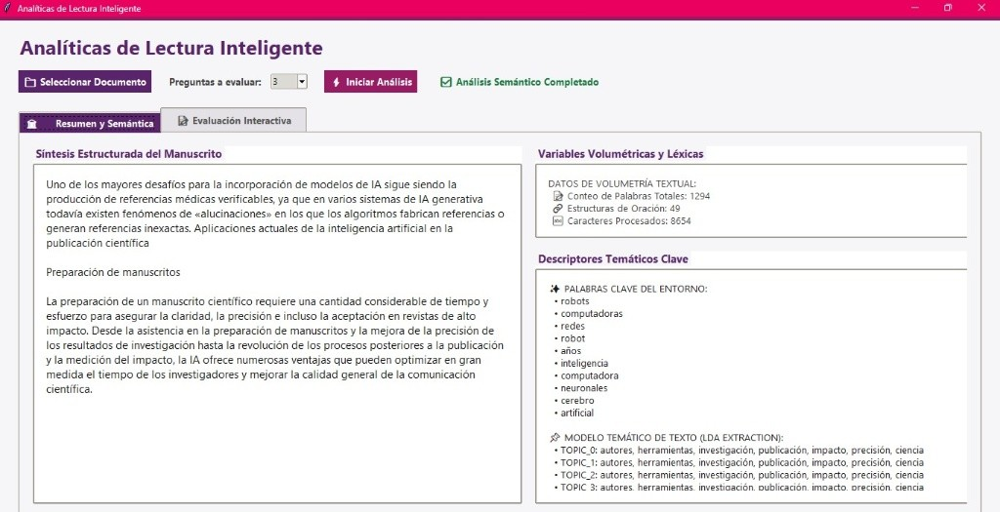
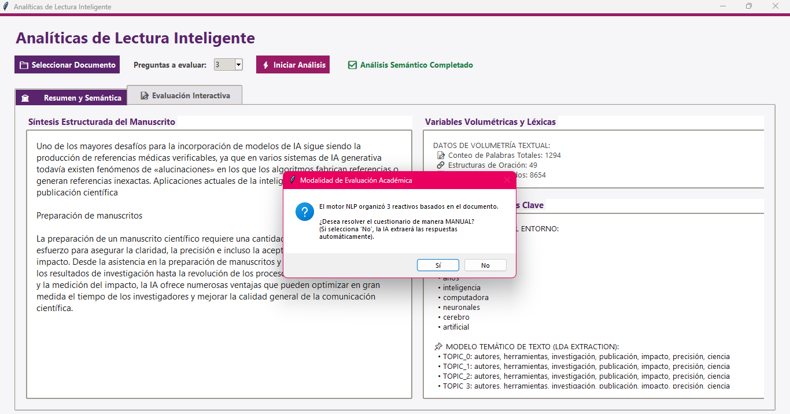
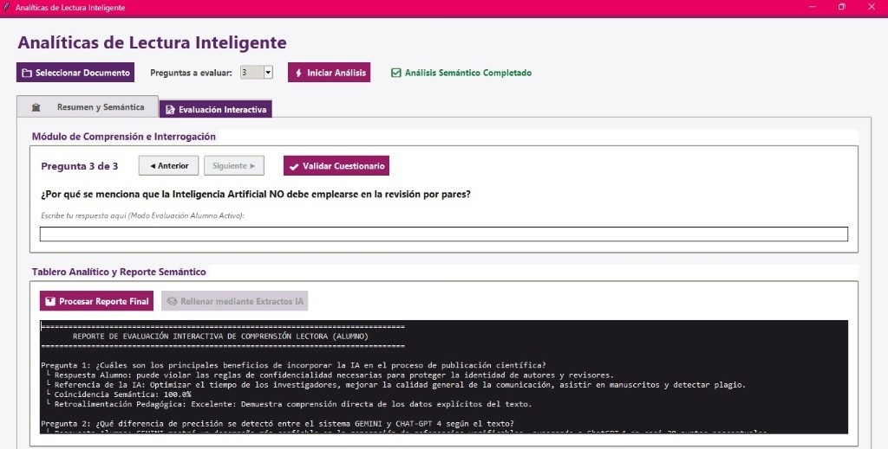

<p align="center">
  
</p>

<h1 align="center">
📖 Analíticas de Lectura Inteligente
</h1>

<p align="center">
Potenciando el Aprendizaje con Inteligencia Artificial
</p>

## 🎯 Descripción

Este proyecto fue desarrollado como trabajo de tesis para la obtención del grado de Ingeniería en Tecnologías de la Información.

Su propósito es aplicar técnicas de Inteligencia Artificial y Procesamiento de Lenguaje Natural (NLP) para fortalecer la comprensión lectora mediante el análisis automatizado de documentos, la generación de preguntas y la evaluación semántica de las respuestas del usuario.

La herramienta está dirigida principalmente a estudiantes como apoyo autodidacta, aunque también puede ser utilizada por docentes para identificar oportunidades de mejora en el aprendizaje de sus alumnos.

---

## 💡 Problema que resuelve

Actualmente, muchos estudiantes presentan dificultades para comprender, analizar e interpretar la información que leen, lo que afecta su capacidad para construir conocimiento y generar ideas propias.

Este proyecto busca apoyar dicho proceso mediante una herramienta inteligente capaz de:

- Analizar documentos PDF.
- Detectar automáticamente el idioma.
- Traducir el contenido cuando es necesario.
- Generar resúmenes.
- Crear preguntas automáticamente.
- Evaluar respuestas utilizando modelos de IA.
- Medir la coherencia semántica entre pregunta y respuesta.
- Generar reportes con métricas de desempeño.

---

## ✨ Objetivos

### Objetivo General
Desarrollar una herramienta basada en Inteligencia Artificial y Procesamiento de Lenguaje Natural capaz de fortalecer la comprensión lectora mediante el análisis automático de documentos, la generación de preguntas y la evaluación semántica de respuestas.

### Objetivos específicos
- Detectar automáticamente el idioma del documento.
- Analizar el contenido mediante técnicas de NLP.
- Extraer los temas principales del texto.
- Generar preguntas de manera automática.
- Evaluar la coherencia semántica de las respuestas.
- Generar métricas que apoyen el aprendizaje del estudiante.

---

## 🚀 Funcionamiento general
1. El usuario carga un documento.
2. El sistema analiza el contenido.
3. Se identifican los temas principales.
4. Se generan preguntas automáticamente.
5. El usuario responde.
6. La IA analiza las respuestas.
7. Se genera un reporte con métricas.

---

## 🧠 Arquitectura de IA

| Modelo | Función |
|---------|----------|
| spaCy | Procesamiento del lenguaje |
| NLTK | Tokenización |
| YAKE | Extracción de palabras clave |
| LDA | Detección de temas |
| T5 | Generación automática de preguntas |
| RoBERTa QA | Extracción de respuestas |
| Sentence Transformers | Evaluación semántica |
| fast-langdetect | Detección del idioma |

---

## 📊 Arquitectura del Sistema

El siguiente diagrama muestra el flujo completo del sistema desarrollado, desde la carga del documento hasta la generación del reporte final. Cada etapa representa un módulo del pipeline de Procesamiento de Lenguaje Natural (NLP) y los modelos de Inteligencia Artificial utilizados durante el análisis.

<p align="center">
  
</p>

El sistema inicia con la carga del documento, realiza el preprocesamiento y la detección automática del idioma. Posteriormente ejecuta un pipeline de NLP que incluye tokenización, procesamiento lingüístico, extracción de palabras clave, modelado de temas y generación de resúmenes. Finalmente genera preguntas, analiza las respuestas del usuario mediante RoBERTa QA, calcula la similitud semántica utilizando Sentence Transformers y produce un reporte con métricas y analíticas del aprendizaje.

---

## 📂 Estructura del proyecto

```text
analiticas_lectura_inteligente_ia
│
├── README.md
├── LICENSE
├── requirements.txt
│
├── assets/
│   ├── Banner.png
│   ├── Diagrama.png
│   ├── interfazPrincipal.png
│   ├── seleccionDocumento.png
│   ├── rutaReporte.png
│   ├── resumenAnalisis.jpg
│   ├── resumenModalidad.png
│   └── evaluacionInteractiva.jpg
│
├── src/
│   ├── main.py
│   ├── preprocessing.py
│   ├── language_detector.py
│   ├── topic_model.py
│   ├── question_generator.py
│   ├── answer_extractor.py
│   ├── semantic_similarity.py
│   └── report_generator.py
│
└── examples/
...

---

## 🛠️ Tecnologías y Herramientas Utilizadas

<div align="center">

| Categoría | Tecnologías / Librerías |
| :--- | :--- |
| **Lenguaje Principal** |  |
| **Core NLP & ML** |    |
| **Modelos Especificos** | **Sentence Transformers**, **T5**, **RoBERTa QA**, **YAKE**, **LDA** |
| **Entornos y Herramientas** |    |

</div>

---

## ⚙️ Instalación y Configuración

Sigue estos pasos para clonar y ejecutar el entorno de desarrollo localmente:

1. **Clonar el repositorio:**
   ```bash
   git clone [https://github.com/citlallimt/analiticas_lectura_inteligente_ia.git](https://github.com/citlallimt/analiticas_lectura_inteligente_ia.git)
```


Entrar al proyecto


```bash

cd analiticas_lectura_inteligente_ia

```


Instalar dependencias


```bash

pip install -r requirements.txt

```


Ejecutar


```bash

python src/main.py

```

## 📊 Resultados Generados y Casos de Uso


A continuación se detalla el comportamiento del prototipo funcional durante la carga, análisis y procesamiento semántico de un manuscrito técnico:


### 1️⃣ Inicio e Interfaz Principal

Al ejecutar la aplicación, el usuario accede al panel principal de **Analíticas de Lectura Inteligente**. En esta etapa inicial se define la cantidad de preguntas a evaluar y el sistema queda a la espera de la carga del documento fuente.


<p align="center">

  

</p>


---


### 2️⃣ Selección de Documento y Destino del Reporte

El usuario selecciona el manuscrito en formato de texto (`.txt`) y especifica la carpeta de destino donde se guardará automáticamente el reporte analítico resultante.


<p align="center">

  

  

</p>


---


### 3️⃣ Análisis Sintáctico y Descriptores Temáticos

Una vez procesado el documento, la pestaña **Resumen y Semántica** despliega inmediatamente las métricas cuantitativas y cualitativas extraídas del texto:


<p align="center">

  

</p>


* **Síntesis Estructurada:** Generación automática del resumen ejecutivo del manuscrito.

* **Variables Volumétricas:** Conteo preciso de palabras totales, oraciones procesadas y caracteres.

* **Descriptores Temáticos Clave:** Extracción de palabras clave del entorno y agrupación de tópicos probabilísticos mediante **LDA Extraction**.


---


### 4️⃣ Selección de Modalidad de Evaluación

Tras mostrar el análisis sintáctico inicial, la aplicación despliega una ventana emergente para elegir cómo se resolverá la evaluación:


<p align="center">

  

</p>


* **Si selecciona "No" (Modo Automático):** La IA extrae y contesta de forma automatizada las respuestas basándose en el texto, procesando el análisis semántico y generando el reporte final de manera inmediata sin requerir intervención del usuario.

* **Si selecciona "Sí" (Modo Manual / Alumno):** El sistema habilita la pestaña **Evaluación Interactiva** para que el estudiante responda los reactivos por sí mismo.


---


### 5️⃣ Evaluación Interactiva y Validación Semántica

En caso de elegir la **modalidad manual**, el usuario pasa a la pestaña **Evaluación Interactiva**:


1. **Escritura de Respuestas:** El sistema muestra las preguntas formuladas por la IA y habilita los campos de texto para que el estudiante redacte sus propias respuestas.

2. **Validación del Cuestionario:** Una vez contestados los reactivos, el usuario presiona el botón **Validar Cuestionario**.

3. **Análisis Semántico y Reporte:** El modelo **Sentence Transformers** evalúa en tiempo real las respuestas ingresadas contra las referencias de la IA, calcula el porcentaje de coincidencia semántica y despliega el reporte analítico con la retroalimentación pedagógica en el tablero inferior.


<p align="center">

  

</p>


* **Módulo de Comprensión:** Visualización de preguntas generadas por la IA y campo editable para captura manual del estudiante.

* **Tablero Analítico:** Generación del reporte en pantalla tras la validación, mostrando el % de similitud semántica, contraste de respuestas y retroalimentación personalizada.

## 📈 Estado del proyecto

✅ Proyecto de tesis finalizado.

📌 Nota: Este proyecto fue desarrollado con fines académicos para la obtención del título de Ingeniería en Tecnologías de la Información en la Universidad Politecnica Metropolitana de Hidalgo . El código se comparte exclusivamente de forma pública con fines de demostración de competencias profesionales y portafolio laboral. 

